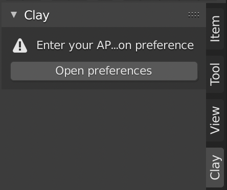

# Clay Blender Addon

Export models from Blender directly into Clay!

# How to install

1. Download the Clay Blender Addon as a zip file

2. Open Blender, and navigate to `Edit > Preferences`

3. At this point, the Blender Preferences window should open. Go to the Add-ons tab.

4. Click `Install` and then select the Clay Bender Addon zip file.

5. Type in `Clay` into the search bar and you should see an option that says `Import-Export: Clay`. Click the checkbox next to that option to enable to the Clay Addon. You should now see the Clay Addon in the right sidebar.

# How to use

1. Once you have enabled the the Clay Addon, you can find it here. The first time that you use it, you will have to enter an API key. To do this click on "Open Preferences"

2. This should open the Blender Preferences. Once you expand the options for Import-Export: Clay by clicking the caret, you should see a field to input the API Key.

3. From the account settings of your Clay account, you will find this page. You can either generate the API Key for the first time, or Regenerate any subsequent time. This page can be found at this url:
   `https://www.clay3d.io/`WorkspaceSlug`/settings/api`

4. After you paste the API key into the Blender Preferences, the Clay Addon window should be populated with the list of workspaces you have access to and automatically filled in with the title of your Blender file. At this point you can click `Export to Clay`

5. Exporting to clay may take some time, but once it is complete, you will see this popup. You can now click `Open in Clay`!

